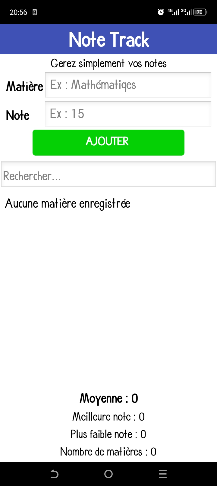

# Note-track
Une application mobile simple pour les étudiants pour suivre les notes et calculer leur moyenne.

## Présentation

NoteTrack est une application mobile simple permettant aux étudiants d'enregistrer, consulter et gérer facilement leurs notes scolaires.

L'application permet également de calculer automatiquement la moyenne.

## Fonctionnalités

- Ajouter une matière et une note
- Afficher la liste des matières enregistrées
- Modifier une note
- Supprimer une matière
- Calculer automatiquement la moyenne
- Afficher des statistiques
- Sauvegarder les données localement avec TinyDB
- Confirmer la suppression d'une matière
- Effacer automatiquement les champs après certaines opérations
- Afficher un message lorsqu'aucune matière n'est enregistrée

## Captures d'écran

Elle présente la seule interface et fonctionnalités de Note Track 

 ###Technologies utilisées

- MIT App Inventor : développement de l'application
- TinyDB : stockage local des données
- Android : plateforme cible

## Installation

1. Télécharger le fichier APK depuis la section Releases de ce dépôt.
2. Transférer le fichier APK sur un appareil Android.
3. Installer l'application.
4. Ouvrir Note Track et commencer à enregistrer des notes.

«L'installation d'une application provenant d'une source externe peut nécessiter l'autorisation d'installation depuis des sources inconnues dans les paramètres Android.»

## Utilisation

1. Ouvrir l'application Note Track.
2. Ajouter une matière et saisir la note correspondante.
3. Consulter la liste des matières enregistrées.
4. Utiliser les fonctionnalités de modification ou de suppression si nécessaire.
5. Consulter la moyenne et les statistiques.

## Démonstration

Une vidéo de démonstration présente le fonctionnement et les principales fonctionnalités de NoteTrack.

[Voir la vidéo de démonstration](https://youtube.com/shorts/hjEDMVqlg6k?si=0TXdTVRRoOLu4uoX)

## Téléchargement

La dernière version de NoteTrack est disponible dans la section Releases de ce dépôt.

Télécharger l'APK : [Note Track APK](release)

## Auteur

Samuel Dieu-donné Koïba

Étudiant en Génie informatique et développeur débutant passionné par la programmation et la création d'applications mobiles.

## License

Ce projet est distribué sous la licence MIT.

Vous pouvez consulter le fichier "LICENSE" pour connaître les conditions d'utilisation, de modification et de distribution du projet.

## Améliorations futures

Voici quelques fonctionnalités qui pourraient être ajoutées dans les prochaines versions :

- Gestion de plusieurs classes ou semestres
- Amélioration des statistiques
- Ajout de graphiques
- Amélioration de l'interface utilisateur
- Synchronisation des données
- Exportation des résultats
- Ajout de rappels
